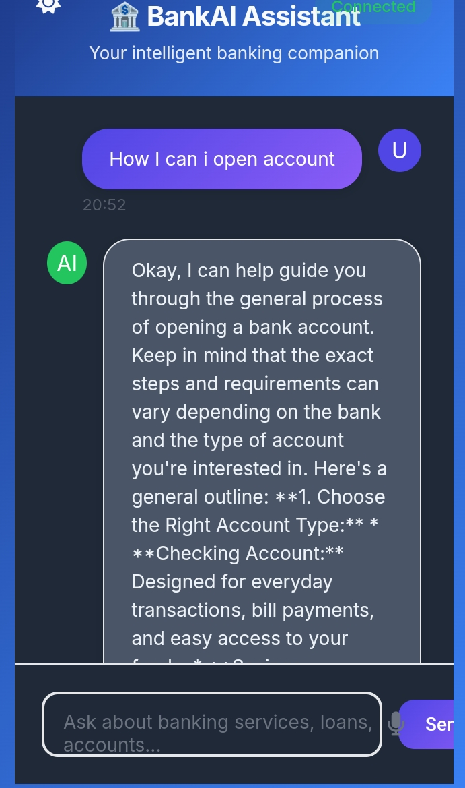
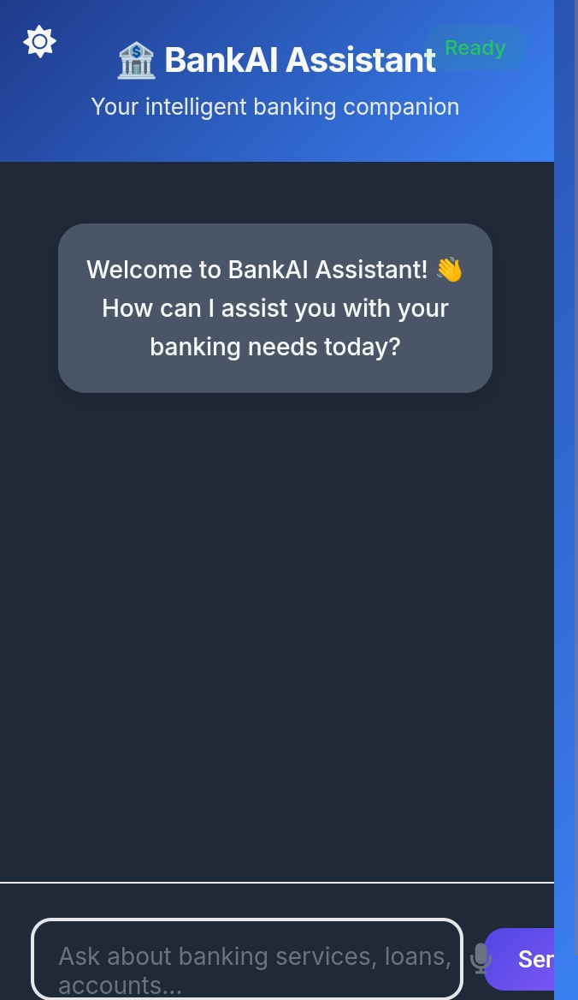

# Bank-management-chatbot

  

Welcome to the BankAI Assistant, an intelligent chatbot designed to assist users with banking-related queries. This web-based application provides information on banking services, loans, accounts, and more, featuring a modern, responsive interface with light and dark mode support.

### Overview

  

The BankAI Assistant is built using HTML, CSS, and JavaScript, leveraging external libraries like Google Fonts and Font Awesome for styling. It includes a chat interface where users can interact with an AI-powered assistant, with features such as:

Real-time messaging with typing indicators.

Theme toggling between light and dark modes.

Responsive design for desktop, tablet, and mobile devices.

Avatar and timestamp support for messages.

Placeholder for future voice input functionality.

The assistant is powered by an external API (e.g., Gemini API), requiring an API key for full functionality.

### Features

Banking Support: Provides information on accounts, loans, credit cards, and general financial advice (not a certified financial advisor).

Security: Avoids handling sensitive data like account numbers or passwords, directing users to official channels for such operations.

User Interface: Modern design with gradient animations, chat bubbles, and micro-interactions.

Accessibility: Includes ARIA attributes for screen reader compatibility and keyboard navigation.

Customizability: Theme toggle and responsive layout adjustments.

### Prerequisites

A web browser (e.g., Chrome, Firefox, Safari).

Internet connection to load external resources (Google Fonts, Font Awesome, and API).

A valid API key for the generative language model (replace the placeholder in script.js).

### Techstack
      
      
